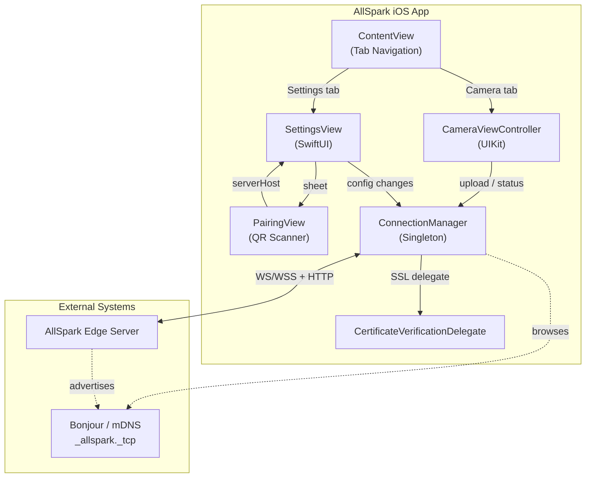
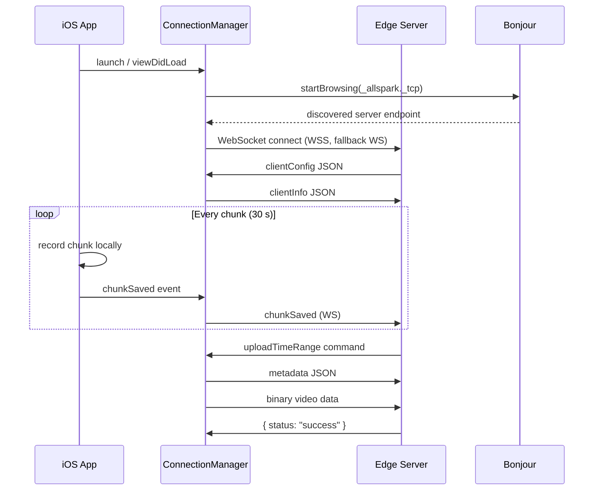

# AllSpark iOS — Requirements & Architecture

> **Purpose**: Machine- and human-readable reference for the AllSpark iOS client's features, architecture, and source layout.

## Architecture

## Source File Index

| File | Role | Key Symbols |
|------|------|-------------|
| [AllSpark_iosApp.swift](AllSpark-ios/AllSpark_iosApp.swift) | App entry point | `@main` |
| [ContentView.swift](AllSpark-ios/ContentView.swift) | Tab-based navigation (Camera / Settings) | `ContentView` |
| [CameraViewController.swift](AllSpark-ios/CameraViewController.swift) | Camera capture, face detection, recording, upload UI | `setupCamera`, `startRecording`, `stopRecording`, `handleRemoteCommand`, `uploadVideo`, `detectFaces` |
| [ConnectionManager.swift](AllSpark-ios/ConnectionManager.swift) | WebSocket lifecycle, Bonjour discovery, upload pipeline | `connect`, `connectWebSocket`, `sendClientInfo`, `receiveWebSocketMessage`, `uploadFile`, `startBrowsing`, `manageVideoStorage` |
| [SettingsView.swift](AllSpark-ios/SettingsView.swift) | Server host config, SSL toggle, discovered servers picker | `SettingsView`, `@AppStorage` bindings |
| [PairingView.swift](AllSpark-ios/PairingView.swift) | QR code scanner for server pairing | `PairingView`, `QRScannerController`, `ScannerViewController` |
| [CertificateVerificationDelegate.swift](AllSpark-ios/CertificateVerificationDelegate.swift) | Custom SSL pinning / trust override | `CertificateVerificationDelegate` |

## Feature Requirements

### Camera & Recording

| ID | Requirement | Source |
|----|-------------|--------|
| REQ-iOS-001 | Real-time video capture from front or back camera | [CameraViewController.swift](AllSpark-ios/CameraViewController.swift) |
| REQ-iOS-002 | Camera switching (front ↔ back) | [CameraViewController.swift](AllSpark-ios/CameraViewController.swift) |
| REQ-iOS-003 | Continuous chunked recording (default 30 s, configurable via `videoChunkDurationMs`) | [CameraViewController.swift](AllSpark-ios/CameraViewController.swift) |
| REQ-iOS-004 | Video format selection: MP4 (default) or MOV | [ConnectionManager.swift](AllSpark-ios/ConnectionManager.swift) |
| REQ-iOS-005 | Automatic storage cleanup — oldest chunks deleted when total exceeds `videoBufferMaxMB` | [ConnectionManager.swift#manageVideoStorage](AllSpark-ios/ConnectionManager.swift) |

### Privacy

| ID | Requirement | Source |
|----|-------------|--------|
| REQ-iOS-010 | Face detection using Vision framework | [CameraViewController.swift#detectFaces](AllSpark-ios/CameraViewController.swift) |
| REQ-iOS-011 | Real-time face pixelation/blurring on preview and recorded output | [CameraViewController.swift](AllSpark-ios/CameraViewController.swift) |

### Networking

| ID | Requirement | Source |
|----|-------------|--------|
| REQ-iOS-020 | WebSocket connection to edge server (WS/WSS with automatic fallback) | [ConnectionManager.swift#connectWebSocket](AllSpark-ios/ConnectionManager.swift) |
| REQ-iOS-021 | `clientInfo` identification sent on connect | [ConnectionManager.swift#sendClientInfo](AllSpark-ios/ConnectionManager.swift) |
| REQ-iOS-022 | Receive and apply `clientConfig` from server | [ConnectionManager.swift#receiveWebSocketMessage](AllSpark-ios/ConnectionManager.swift) |
| REQ-iOS-023 | Two-phase upload: JSON metadata → binary data | [ConnectionManager.swift#uploadFile](AllSpark-ios/ConnectionManager.swift) |
| REQ-iOS-024 | On-demand upload: user tap **or** server `uploadTimeRange` command | [CameraViewController.swift#handleRemoteCommand](AllSpark-ios/CameraViewController.swift) |
| REQ-iOS-025 | Notify server of `chunkSaved` events for agent relay | [ConnectionManager.swift](AllSpark-ios/ConnectionManager.swift) |

### Discovery & Pairing

| ID | Requirement | Source |
|----|-------------|--------|
| REQ-iOS-030 | Bonjour/mDNS auto-discovery of `_allspark._tcp` services | [ConnectionManager.swift#startBrowsing](AllSpark-ios/ConnectionManager.swift) |
| REQ-iOS-031 | QR code scanning for out-of-band server pairing | [PairingView.swift](AllSpark-ios/PairingView.swift) |
| REQ-iOS-032 | Discovered servers picker in Settings | [SettingsView.swift](AllSpark-ios/SettingsView.swift) |

### Connection Resilience

| ID | Requirement | Source |
|----|-------------|--------|
| REQ-iOS-040 | Connection status indicator (red/orange/green WiFi icon + lock for WSS) | [CameraViewController.swift#updateConnectionStatusIcon](AllSpark-ios/CameraViewController.swift) |
| REQ-iOS-041 | Automatic reconnection (5 s interval) on server disconnection | [ConnectionManager.swift](AllSpark-ios/ConnectionManager.swift) |
| REQ-iOS-042 | User alert on connection loss with Reconnect/Dismiss options | [CameraViewController.swift](AllSpark-ios/CameraViewController.swift) |
| REQ-iOS-043 | SSL certificate verification toggle (for self-signed certs) | [SettingsView.swift](AllSpark-ios/SettingsView.swift), [CertificateVerificationDelegate.swift](AllSpark-ios/CertificateVerificationDelegate.swift) |

## Connection & Upload Flow

## Planned / Future

- Privacy-preserving depth/mesh exports
- Additional export format support
- Multi-server management
