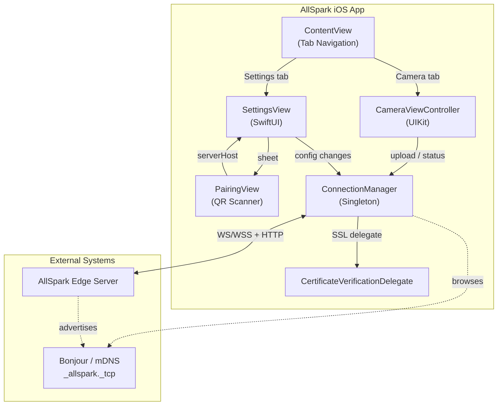
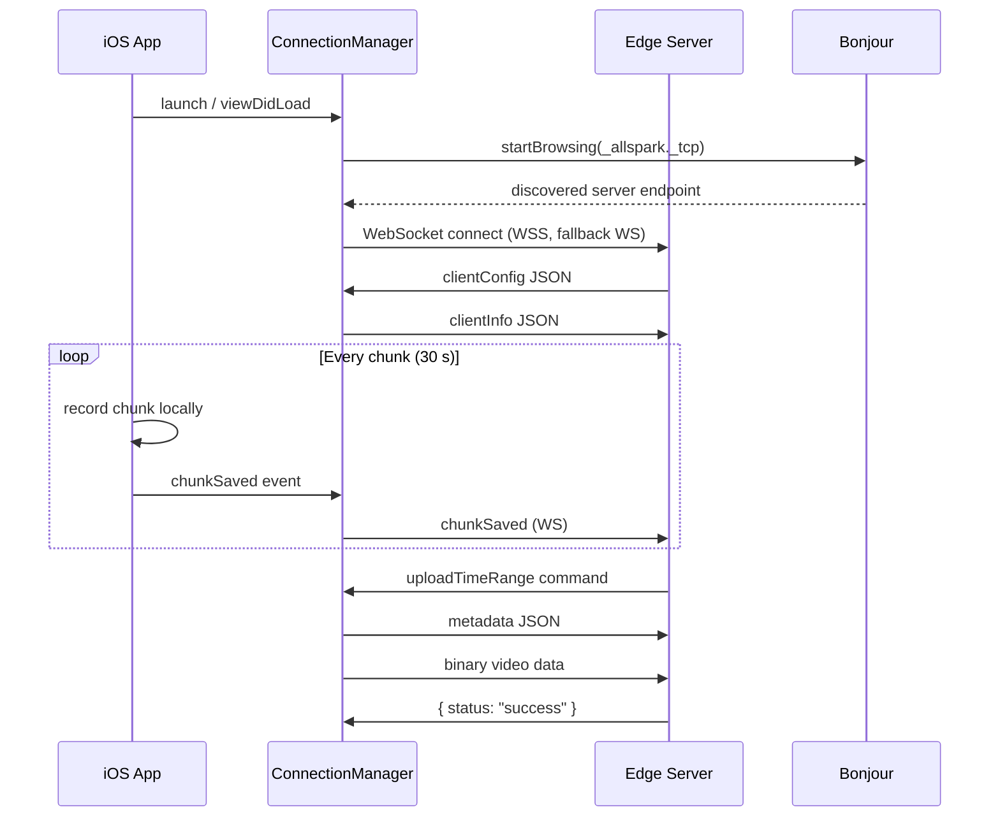

# AllSpark iOS — Requirements & Architecture

> **Purpose**: Machine- and human-readable reference for the AllSpark iOS client's features, architecture, and source layout.

## Architecture

## Source File Index

| File | Role | Key Symbols |
|------|------|-------------|
| [AllSpark_iosApp.swift](AllSpark-ios/AllSpark_iosApp.swift) | App entry point | `@main` |
| [ContentView.swift](AllSpark-ios/ContentView.swift) | Tab-based navigation (Camera / Settings) | `ContentView` |
| [CameraViewController.swift](AllSpark-ios/CameraViewController.swift) | Camera capture, face detection, recording, upload UI | `setupCamera`, `startRecording`, `stopRecording`, `handleRemoteCommand`, `uploadVideo`, `detectFaces` |
| [ConnectionManager.swift](AllSpark-ios/ConnectionManager.swift) | WebSocket lifecycle, Bonjour discovery, upload pipeline | `connect`, `connectWebSocket`, `sendClientInfo`, `receiveWebSocketMessage`, `uploadFile`, `startBrowsing`, `manageVideoStorage` |
| [SettingsView.swift](AllSpark-ios/SettingsView.swift) | Server host config, SSL toggle, discovered servers picker | `SettingsView`, `@AppStorage` bindings |
| [PairingView.swift](AllSpark-ios/PairingView.swift) | QR code scanner for server pairing | `PairingView`, `QRScannerController`, `ScannerViewController` |
| [CertificateVerificationDelegate.swift](AllSpark-ios/CertificateVerificationDelegate.swift) | Custom SSL pinning / trust override | `CertificateVerificationDelegate` |
| [CommunicationsManager.swift](AllSpark-ios/CommunicationsManager.swift) | Transport detection, Bluetooth monitoring, comms policy enforcement | `CommunicationsManager`, `applyPolicy`, `activeTransport`, `gateViolations` |

## Data Security

> **Goal**: AllSpark-iOS is a closed application. Generated content (video, audio) must only leave the device through approved communications channels to the edge server. No user-initiated or external-app file export is permitted.

| ID | Requirement | Source |
|----|-------------|--------|
| REQ-SEC-001 | `UIFileSharingEnabled = NO` — recordings are not visible in Files.app or iTunes | [project.pbxproj](AllSpark-ios.xcodeproj/project.pbxproj) |
| REQ-SEC-002 | `LSSupportsOpeningDocumentsInPlace = NO` — documents cannot be opened by other apps in place | [project.pbxproj](AllSpark-ios.xcodeproj/project.pbxproj) |
| REQ-SEC-003 | No manual upload UI — video uploads are server-initiated only via `uploadTimeRange` command | [CameraViewController.swift](AllSpark-ios/CameraViewController.swift) |
| REQ-SEC-004 | Communications policy gate blocks app interaction when server-disabled protocols are detected enabled | [CommunicationsManager.swift](AllSpark-ios/CommunicationsManager.swift), [ContentView.swift](AllSpark-ios/ContentView.swift) |
| REQ-SEC-005 | Transport mismatch warning when active transport conflicts with server communications policy | [CommunicationsManager.swift](AllSpark-ios/CommunicationsManager.swift), [SettingsView.swift](AllSpark-ios/SettingsView.swift) |

## Feature Requirements

### Camera & Recording

| ID | Requirement | Source |
|----|-------------|--------|
| REQ-iOS-001 | Real-time video capture from front or back camera | [CameraViewController.swift](AllSpark-ios/CameraViewController.swift) |
| REQ-iOS-002 | Camera switching (front ↔ back) | [CameraViewController.swift](AllSpark-ios/CameraViewController.swift) |
| REQ-iOS-003 | Continuous chunked recording (default 30 s, configurable via `videoChunkDurationMs`) | [CameraViewController.swift](AllSpark-ios/CameraViewController.swift) |
| REQ-iOS-004 | Video format selection: MP4 (default) or MOV | [ConnectionManager.swift](AllSpark-ios/ConnectionManager.swift) |
| REQ-iOS-005 | Automatic storage cleanup — oldest chunks deleted when total exceeds `videoBufferMaxMB` | [ConnectionManager.swift#manageVideoStorage](AllSpark-ios/ConnectionManager.swift) |

### Privacy

| ID | Requirement | Source |
|----|-------------|--------|
| REQ-iOS-010 | Face detection using Vision framework | [CameraViewController.swift#detectFaces](AllSpark-ios/CameraViewController.swift) |
| REQ-iOS-011 | Real-time face pixelation/blurring on preview and recorded output | [CameraViewController.swift](AllSpark-ios/CameraViewController.swift) |

### Networking

| ID | Requirement | Source |
|----|-------------|--------|
| REQ-iOS-020 | WebSocket connection to edge server (WS/WSS with automatic fallback) | [ConnectionManager.swift#connectWebSocket](AllSpark-ios/ConnectionManager.swift) |
| REQ-iOS-021 | `clientInfo` identification sent on connect | [ConnectionManager.swift#sendClientInfo](AllSpark-ios/ConnectionManager.swift) |
| REQ-iOS-022 | Receive and apply `clientConfig` from server | [ConnectionManager.swift#receiveWebSocketMessage](AllSpark-ios/ConnectionManager.swift) |
| REQ-iOS-023 | Two-phase upload: JSON metadata → binary data | [ConnectionManager.swift#uploadFile](AllSpark-ios/ConnectionManager.swift) |
| REQ-iOS-024 | Server-initiated upload via `uploadTimeRange` command | [CameraViewController.swift#handleRemoteCommand](AllSpark-ios/CameraViewController.swift) |
| REQ-iOS-025 | Notify server of `chunkSaved` events for agent relay | [ConnectionManager.swift](AllSpark-ios/ConnectionManager.swift) |

### Discovery & Pairing

| ID | Requirement | Source |
|----|-------------|--------|
| REQ-iOS-030 | Bonjour/mDNS auto-discovery of `_allspark._tcp` services | [ConnectionManager.swift#startBrowsing](AllSpark-ios/ConnectionManager.swift) |
| REQ-iOS-031 | QR code scanning for out-of-band server pairing | [PairingView.swift](AllSpark-ios/PairingView.swift) |
| REQ-iOS-032 | Discovered servers picker in Settings | [SettingsView.swift](AllSpark-ios/SettingsView.swift) |

### Connection Resilience

| ID | Requirement | Source |
|----|-------------|--------|
| REQ-iOS-040 | Connection status indicator (red/orange/green WiFi icon + lock for WSS) | [CameraViewController.swift#updateConnectionStatusIcon](AllSpark-ios/CameraViewController.swift) |
| REQ-iOS-041 | Automatic reconnection (5 s interval) on server disconnection | [ConnectionManager.swift](AllSpark-ios/ConnectionManager.swift) |
| REQ-iOS-042 | User alert on connection loss with Reconnect/Dismiss options | [CameraViewController.swift](AllSpark-ios/CameraViewController.swift) |
| REQ-iOS-043 | SSL certificate verification toggle (for self-signed certs) | [SettingsView.swift](AllSpark-ios/SettingsView.swift), [CertificateVerificationDelegate.swift](AllSpark-ios/CertificateVerificationDelegate.swift) |

### Communications Management

| ID | Requirement | Source |
|----|-------------|--------|
| REQ-iOS-050 | Detect active network transport (Wi-Fi, Cellular, Ethernet, USB) via NWPathMonitor | [CommunicationsManager.swift](AllSpark-ios/CommunicationsManager.swift) |
| REQ-iOS-051 | Monitor Bluetooth power state via CoreBluetooth only when server policy enables it; gate app interaction if Bluetooth is detected ON while policy requires OFF | [CommunicationsManager.swift](AllSpark-ios/CommunicationsManager.swift) |
| REQ-iOS-052 | Gate app interaction with full-screen blocker when Bluetooth or AirDrop violations are detected | [ContentView.swift](AllSpark-ios/ContentView.swift) |
| REQ-iOS-053 | Warn user when active transport conflicts with server-sent `communicationsPolicy` (mismatch detection) | [CommunicationsManager.swift](AllSpark-ios/CommunicationsManager.swift) |
| REQ-iOS-054 | Post-connection policy enforcement: prompt user to disable protocols the server policy requires off | [CommunicationsManager.swift](AllSpark-ios/CommunicationsManager.swift), [ContentView.swift](AllSpark-ios/ContentView.swift) |
| REQ-iOS-055 | UWB, NFC, and Satellite policy enforcement — deferred to future work (no public iOS API for runtime state detection) | [CommunicationsManager.swift](AllSpark-ios/CommunicationsManager.swift) |

## Connection & Upload Flow

## Planned / Future

- Privacy-preserving depth/mesh exports
- Additional export format support
- Multi-server management
- UWB/NFC/Satellite runtime state detection and policy enforcement (pending public iOS API or cross-platform clients)

### Implemented (current release)

| ID | Requirement | Source |
|----|-------------|--------|
| REQ-iOS-060 | Persistent 3-digit client nonce for collision avoidance; auto-appended if device name lacks 3+ consecutive digits | [ConnectionManager.swift#getClientDisplayName](AllSpark-ios/ConnectionManager.swift) |
| REQ-iOS-061 | Frame-level NTP-synced timestamp metadata (`timestamps_*.txt`) generated per video chunk using hardware `CMTime` mapped to wall-clock | [CameraViewController.swift#recordVideoFrame](AllSpark-ios/CameraViewController.swift) |
| REQ-iOS-062 | Capture modality overlay on recording screen showing active capture modes (Video, Audio) | [CameraViewController.swift#startRecordingChunk](AllSpark-ios/CameraViewController.swift) |
| REQ-iOS-063 | Video chunks named `chunk_{epochMs}.mp4` where timestamp is the first frame's wall-clock time in milliseconds | [CameraViewController.swift#stopRecordingChunk](AllSpark-ios/CameraViewController.swift) |
| REQ-iOS-064 | Companion `timestamps_*.txt` uploaded alongside video chunks during server-initiated uploads | [CameraViewController.swift#handleUploadTimeRange](AllSpark-ios/CameraViewController.swift) |

## Future Architecture: Full RGBD Export Recommendations
Apple limits multi-track mixed media streams due to the encoding constraints of standard `.mp4`. However, `AllSpark-iOS` can support capturing unified reality volumes using the following standard workflows:

1. **Format**: Use `.mov` HEVC / H.265 files (not `.mp4`) to store depth tracks natively. Apple provides native parsing of depth using AVAsset without separate image sequences.
2. **Buffer Encoding**: Use an `AVAssetWriterInputPixelBufferAdaptor` dedicated to a secondary track for 16-bit float depth matrices (`kCVPixelFormatType_DepthFloat16` and LiDAR output if available).
3. **Session Coordination**: The `.mov` track must be explicitly marked as an Auxiliary Track (`AVAssetWriterInput.marksOutputTrackAsEnabled = false` optionally) so standard video players ignore it while specialized data parsers (like the ARENA Edge Server) can extract the exact timestamped depth map matching the color presentation time.
